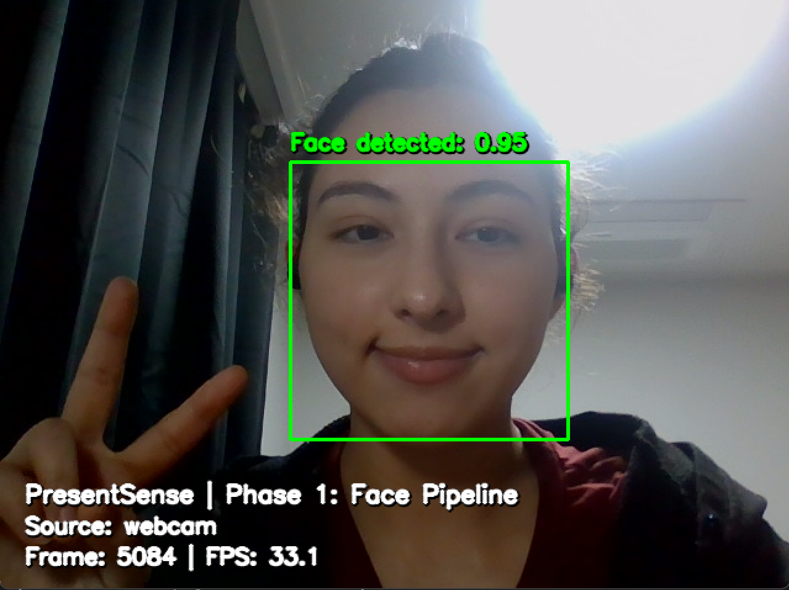
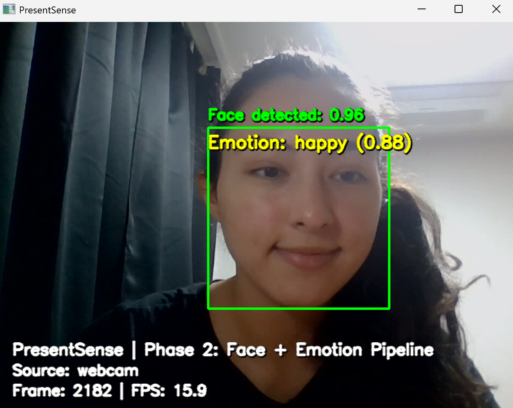
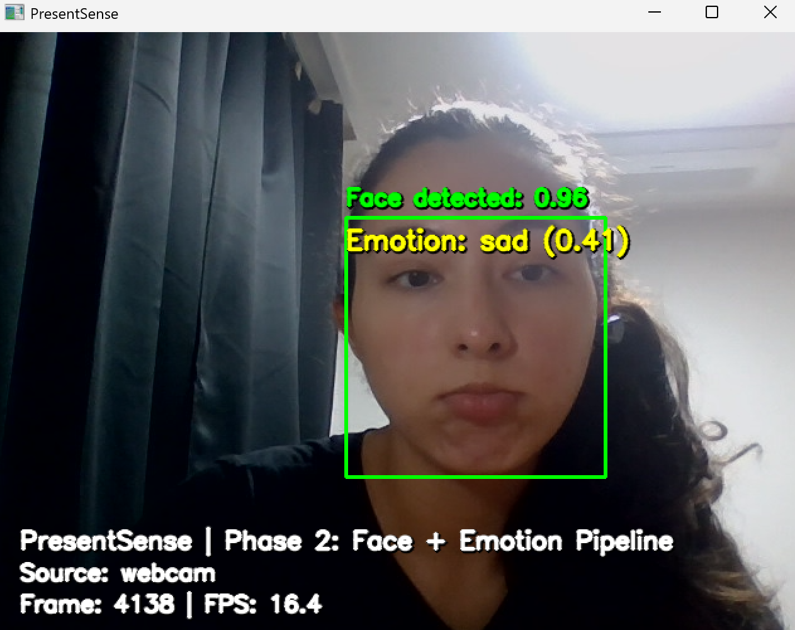
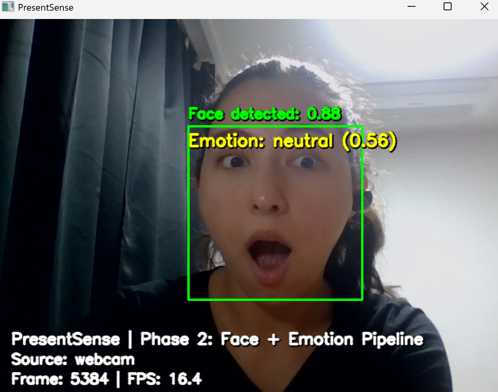

# PresentSense: A Computer Vision-Based Presentation Coach

## Overview

**PresentSense** is a Computer Vision final project that analyzes a presentation video or webcam stream and provides visual feedback about how a student visually presents in front of a camera.

The project is designed as a **visual communication feedback tool** for presentation practice. It uses computer vision techniques to detect the presenter’s face, estimate visible facial expression cues, and prepare the foundation for future presentation metrics such as looking-forward behavior, head movement, posture stability, and expressiveness.

> Important: PresentSense is **not** a medical, psychological, or clinical diagnosis tool. It does not measure true emotions, confidence, personality, or mental health. It only analyzes visible facial and presentation-related visual cues for educational feedback.

---

## Current Status

The project is being built in phases.

| Phase | Status | Description |
|---|---|---|
| Phase 1 | Completed | OpenCV + MediaPipe webcam/video face detection pipeline |
| Phase 2 | Completed | FER2013 emotion recognition training and webcam inference |
| Phase 3 | In progress / next | Presentation visual metrics and report generation |
| Phase 4 | Planned | Streamlit app and final GitHub polish |

---

## Motivation

Students often practice presentations alone and do not receive feedback about visual communication cues such as whether they are facing the audience, visually expressive, stable, or clearly visible on camera.

PresentSense aims to provide a practical computer-vision-based assistant that can analyze a webcam or video recording and generate visual feedback that helps students improve their presentation delivery.

---

## Computer Vision Concepts Used

This project connects directly with core Computer Vision topics:

- OpenCV video input and output.
- Frame-by-frame video processing.
- OpenCV drawing functions and overlays.
- MediaPipe face detection.
- Face cropping and preprocessing.
- Image resizing and normalization.
- Transfer learning for image classification.
- CNN-based facial expression recognition.
- PyTorch model training and inference.
- Confusion matrix and classification metrics.
- Temporal video analysis foundation.
- Annotated video export.

---

## Features

### Implemented in Phase 1

- Webcam analysis.
- Local video analysis.
- Face detection using MediaPipe.
- Bounding box overlay.
- Face detection confidence overlay.
- FPS overlay.
- Frame number overlay.
- Status text when no face is detected.
- Annotated video export to `outputs/videos/`.

### Implemented in Phase 2

- FER2013 dataset loading from folder format.
- Transfer learning experiments with:
  - MobileNetV3 fine-tuning.
  - ResNet18 fine-tuning.
- Emotion classification model training.
- Training and validation curves.
- Confusion matrix generation.
- Experiment results exported to CSV.
- Best checkpoint saving.
- Webcam inference with trained emotion model.
- Face crop preprocessing for model inference.
- Real-time face + expression overlay.

### Planned for Phase 3

- Emotion distribution over time.
- Emotion timeline.
- Looking-forward / approximate eye-contact score.
- Facial expressiveness score.
- Head movement and posture stability score.
- Optional gesture activity score.
- Per-frame metrics CSV.
- Summary JSON report.
- Markdown presentation feedback report.
- Personalized recommendations.

### Planned for Phase 4

- Streamlit web app.
- Video upload interface.
- Results dashboard.
- Downloadable reports.
- Final README polish.
- Final GitHub submission checklist.

---

## Demo

### Phase 1: Face Detection Pipeline

Phase 1 validates the real-time video pipeline. It detects the presenter's face, draws a bounding box, displays confidence, shows FPS, and tracks frame number.



Demo video:

[Watch Phase 1 Webcam Demo](outputs/videos/phase1_webcam_demo.mp4)

---

### Phase 2: Face + Emotion Recognition Pipeline

Phase 2 adds facial expression recognition using a model trained on FER2013. The system detects the face, crops it, preprocesses it, classifies the visible facial expression cue, and displays the predicted class with confidence.

#### Happy Example



#### Sad Example



#### Known Error / Limitation Example

The model may confuse some expressions in real webcam conditions. For example, surprise or neutral expressions may be misclassified depending on lighting, pose, camera quality, and expression intensity.



Demo video:

[Watch Phase 2 ResNet18 Emotion Demo](outputs/videos/phase2_resnet18_emotion_demo.mp4)

> Note: If videos do not preview directly on GitHub, download them from the repository or open them locally.

---

## Dataset

The emotion recognition model uses **FER2013**, a common facial expression recognition dataset.

Expected classes:

```text
angry
disgust
fear
happy
neutral
sad
surprise