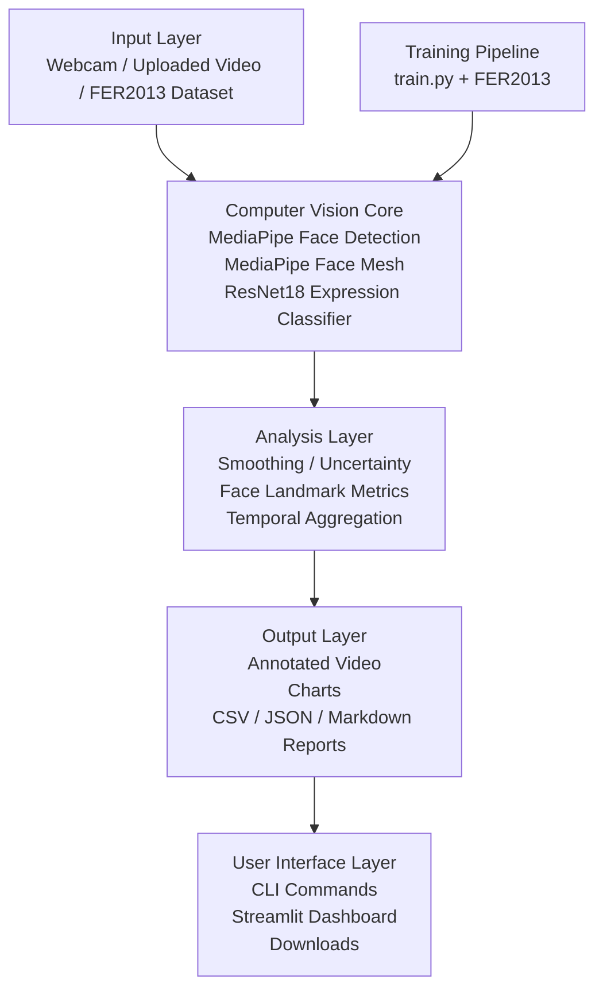

# PresentSense: A Computer Vision-Based Presentation Coach

**PresentSense** is a Computer Vision final project that analyzes a practice presentation video or webcam stream and gives visual feedback for presentation practice.

The final version includes a **Streamlit app** where a student can upload a short presentation video, run the analysis, review a dashboard, inspect charts, read recommendations, and download the generated report.

> **Important:** PresentSense is a visual communication feedback prototype. It is **not** a medical, psychological, clinical, emotion, confidence, personality, or mental-health diagnosis tool.

---

## Final Demo

### Final Phase 4 Demo Video

[Watch Final Phase 4 Demo on YouTube](https://www.youtube.com/watch?v=1owUAk8xLGc)

### Final App Workflow

1. Open the Streamlit app.
2. Review the sidebar settings.
3. Upload a short practice presentation video or use the webcam demo.
4. Run the analysis.
5. Review the dashboard, recommendations, charts, and generated report.
6. Download the analysis ZIP.
7. Clear the current analysis and test another video.

### Home Page


### Sidebar Settings


### Upload Video Workflow


### Webcam Demo

The webcam demo launches the existing OpenCV webcam pipeline. The webcam opens in a separate local OpenCV window. Press `q` or `ESC` to stop the recording and finish the analysis.


### Results Dashboard and Feedback


### Detailed Charts

#### Expression Distribution


#### Expression Timeline


#### Looking-Forward Approximation


#### Head/Face Movement


#### Mouth Openness


### Generated Feedback Report


### Download and Reset Workflow


---

## Project Summary

PresentSense uses OpenCV, MediaPipe, PyTorch, and Streamlit to turn a presentation recording into visual feedback.

It analyzes:

- Face visibility.
- Model-predicted visible facial expression cues.
- Looking-forward approximation.
- Head/face stability.
- Mouth openness and facial landmark movement.
- Overall visual communication score.

It generates:

- Annotated video.
- Dashboard metrics.
- Friendly recommendations.
- Charts.
- Markdown report.
- JSON summary.
- Frame-level CSV.
- Downloadable ZIP.

---

## Current Status

| Phase | Status | Summary |
|---|---|---|
| Phase 1 | Completed | OpenCV + MediaPipe face detection pipeline. |
| Phase 2 | Completed | FER2013 expression classifier training and video inference. |
| Phase 3 | Completed | Face Mesh visual metrics, charts, reports, and recommendations. |
| Phase 3.5 | Completed | Improved uncertainty handling and safer language. |
| Phase 4 | Completed | Final Streamlit app with upload, webcam demo, dashboard, downloads, and reset workflow. |

Previous phase demos are documented separately:

[View Phase 1, Phase 2, and Phase 3 demo history](docs/demo_history.md)

---

## How to Test the Project

### 1. Clone the Repository

```powershell
git clone <repository-url>
cd presentsense
```

### 2. Create and Activate the Environment

```powershell
python -m venv .venv
.\.venv\Scripts\Activate.ps1
python -m pip install --upgrade pip
pip install -r requirements.txt
```

### 3. Add the Model Checkpoint

The trained model checkpoint is not included in GitHub because it can be large.

Place the model here:

```text
models/best_exp03_resnet18_finetune.pth
```

This is the default model used by the app.

### 4. Run the Streamlit App

```powershell
streamlit run app.py
```

### 5. Test with an Uploaded Video

1. Open the **Upload Video** tab.
2. Upload a short practice presentation video.
3. Click **Analyze Uploaded Video**.
4. Review the dashboard, recommendations, charts, report, and downloads.

Recommended local test video path:

```text
data/samples/phase4_practice_presentation.mp4
```

### 6. Test with Webcam

1. Open the **Webcam Demo** tab.
2. Click **Launch Webcam Demo**.
3. Record for 10–30 seconds.
4. Press `q` or `ESC` inside the OpenCV window.
5. Review the generated results.

### 7. Run the CLI Directly

Webcam:

```powershell
python analyze_video.py --source webcam --model models/best_exp03_resnet18_finetune.pth
```

Local video:

```powershell
python analyze_video.py --source data/samples/phase4_practice_presentation.mp4 --model models/best_exp03_resnet18_finetune.pth --output outputs/videos/demo.mp4
```

Disable Face Mesh if needed:

```powershell
python analyze_video.py --source webcam --model models/best_exp03_resnet18_finetune.pth --no-face-mesh
```

Adjust uncertainty threshold:

```powershell
python analyze_video.py --source webcam --model models/best_exp03_resnet18_finetune.pth --uncertainty-threshold 0.65
```

---

## Architecture

PresentSense uses a layered architecture. The main design decision was to keep the working Computer Vision pipeline in `analyze_video.py` and use Streamlit as a product-style interface around it. This keeps webcam/video processing stable while making the project easier to use.



| Layer | Main files | Purpose |
|---|---|---|
| Input | `app.py`, `analyze_video.py`, `dataset.py` | Receives webcam input, uploaded videos, local videos, and FER2013 data. |
| Computer Vision Core | `face_detector.py`, `face_landmarks.py`, `emotion_analyzer.py`, `model.py` | Detects faces, extracts Face Mesh landmarks, and predicts visible expression cues. |
| Analysis | `presentation_metrics.py`, `recommendations.py` | Aggregates frame-level information into presentation scores and feedback. |
| Output | `visualization.py`, `report_generator.py` | Creates overlays, charts, CSV files, JSON summaries, and Markdown reports. |
| UI | `app.py`, `analyze_video.py`, `train.py` | Provides Streamlit, video analysis CLI, and model training CLI. |

More details:

[Read the full architecture notes](docs/architecture.md)

---

## Main Features

### Streamlit App

- Upload video.
- Analyze video with the existing pipeline.
- View results dashboard.
- View friendly feedback.
- View generated charts and Markdown report.
- Download full analysis ZIP.
- Clear current analysis and upload another video.
- Launch webcam demo.

### Computer Vision Pipeline

- OpenCV video input/output.
- MediaPipe face detection.
- MediaPipe Face Mesh landmarks.
- Face crop preprocessing.
- ResNet18 expression classifier.
- Uncertainty thresholding.
- Temporal smoothing.
- Landmark-based visual metrics.


## Dataset

The expression recognition model was trained using FER2013.

Dataset link:

- [FER2013 on Kaggle](https://www.kaggle.com/datasets/msambare/fer2013)

The dataset is not included in this repository because of size and licensing considerations. To reproduce training, download the dataset and place it under:

```text
data/fer2013/
```

Expected folder format:

```text
data/fer2013/train/angry/
data/fer2013/train/disgust/
data/fer2013/train/fear/
data/fer2013/train/happy/
data/fer2013/train/neutral/
data/fer2013/train/sad/
data/fer2013/train/surprise/

data/fer2013/test/angry/
data/fer2013/test/disgust/
data/fer2013/test/fear/
data/fer2013/test/happy/
data/fer2013/test/neutral/
data/fer2013/test/sad/
data/fer2013/test/surprise/
```

---

## Experiments and Results

The best model was **ResNet18 fine-tuned on FER2013**.

| Experiment | Model | Epochs | Batch Size | Test Accuracy | Macro F1 |
|---|---|---:|---:|---:|---:|
| exp04 | MobileNetV3 fine-tune | 10 | 32 | 49.53% | 42.74% |
| exp04 | MobileNetV3 fine-tune | 20 | 32 | 51.49% | 45.62% |
| exp03 | ResNet18 fine-tune | 10 | 16 | **64.11%** | **60.87%** |

Training charts:


More details:

[Read model and dataset notes](docs/model_and_dataset.md)

---

## Repository Structure

```text
presentsense/
├── README.md
├── app.py
├── analyze_video.py
├── train.py
├── requirements.txt
├── config.yaml
├── src/
│   ├── face_detector.py
│   ├── face_landmarks.py
│   ├── emotion_analyzer.py
│   ├── model.py
│   ├── presentation_metrics.py
│   ├── recommendations.py
│   ├── visualization.py
│   └── report_generator.py
├── docs/
│   ├── architecture.md
│   ├── demo_history.md
│   ├── methodology.md
│   ├── model_and_dataset.md
│   └── final_submission_checklist.md
├── data/
├── models/
└── outputs/
    ├── screenshots/
    ├── charts/
    ├── reports/
    ├── videos/
    └── app/
```

---

## Limitations and Ethics

- PresentSense analyzes visual cues only.
- It does not measure true emotion, confidence, personality, mental health, or absolute presentation quality.
- Expression predictions can be affected by lighting, camera angle, occlusion, and FER2013 dataset bias.
- `uncertain` means model confidence was below the selected threshold; it is not a negative judgment.
- Looking-forward is an approximation, not real gaze tracking or eye tracking.
- Head/face stability is not full-body posture analysis.
- Audio, speech quality, slide content, and presentation structure are not analyzed in this version.

More details:

[Read methodology and limitations](docs/methodology.md)

---

## References

This project uses the following tools and resources:

- OpenCV for video I/O and drawing overlays.
- MediaPipe Face Detection and Face Mesh for face and landmark analysis.
- PyTorch and torchvision for model training and inference.
- Streamlit for the final app interface.
- FER2013 dataset from Kaggle for expression recognition training.

Any external open-source libraries are used as dependencies and are listed in `requirements.txt`.

---

## License

MIT License.
