# PresentSense: A Computer Vision-Based Presentation Coach

## Overview

**PresentSense** is a Computer Vision final project that analyzes a presentation video or webcam stream and provides visual feedback for presentation practice.

The system detects the presenter's face, estimates **model-predicted visible facial expression cues**, analyzes **Face Mesh geometry**, approximates **looking-forward behavior**, measures **head/face stability**, and generates a presentation feedback report with charts and recommendations.

> **Important:** PresentSense is **not** a medical, psychological, emotion, confidence, personality, or clinical diagnosis tool. It does not measure true emotions, mental health, personality, confidence, or presentation quality absolutely. It is a visual communication feedback prototype for student presentation practice.

---

## Current Status

| Phase | Status | Description |
|---|---|---|
| Phase 1 | Completed | OpenCV + MediaPipe webcam/video face detection pipeline |
| Phase 2 | Completed | FER2013 expression recognition training and webcam/video inference |
| Phase 3 | Completed | Face Mesh visual metrics, looking-forward approximation, head/face stability, charts, reports, and recommendations |
| Phase 3.5 | Completed | Improved uncertainty handling, safer wording, Face Mesh-based cue interpretation, and organized outputs |
| Phase 4 | Completed | Professional Streamlit app with video upload, dashboard, downloads, reset workflow, webcam recording workflow, downloadable reports, reset workflow |

---

## Motivation

Students often practice presentations alone and receive feedback only after presenting in class. PresentSense helps students review visual communication cues from a practice recording, such as face visibility, looking-forward behavior, head/face stability, visible facial cue variation, and camera presence.

The goal is to provide **supportive feedback** for improving presentation delivery, not to judge personality, confidence, real emotion, or communication ability absolutely.

---

## Computer Vision Concepts Used

This project connects directly with core Computer Vision topics:

- OpenCV video input and output.
- Frame-by-frame video processing.
- OpenCV drawing functions and overlays.
- MediaPipe face detection.
- MediaPipe Face Mesh landmark detection.
- Face cropping and preprocessing.
- Image resizing and normalization.
- Transfer learning for image classification.
- CNN-based facial expression recognition.
- PyTorch model training and inference.
- Softmax confidence and uncertainty thresholding.
- Temporal smoothing of frame-level predictions.
- Geometric landmark analysis.
- Time-series aggregation of visual cues.
- Confusion matrix and classification metrics.
- Chart generation with Matplotlib.
- Markdown/JSON/CSV report generation.
- Streamlit app integration for an interactive user interface.

---

## Features

### Phase 1: Face Detection Pipeline

- Webcam input.
- Local video file input.
- MediaPipe face detection.
- Face bounding box overlay.
- Face detection confidence overlay.
- FPS and frame number overlay.
- Status text when no face is detected.
- Annotated video export.

### Phase 2: Expression Recognition

- FER2013 dataset loader.
- Support for folder and CSV dataset formats.
- Transfer learning experiments:
  - Custom CNN baseline.
  - ResNet18 frozen backbone.
  - ResNet18 fine-tuning.
  - MobileNetV3 fine-tuning.
- Training and validation curves.
- Confusion matrix generation.
- Experiment metrics exported to CSV.
- Best model checkpoint saving.
- Face crop preprocessing for model inference.
- Webcam/video expression inference.
- Rolling probability smoothing.
- Uncertainty handling for low-confidence predictions.

### Phase 3 and 3.5: Presentation Visual Metrics

- Face Mesh landmark extraction.
- Model-predicted visible expression cue timeline.
- Expression distribution with `uncertain` class.
- Looking-forward approximation.
- Head/face stability analysis.
- Mouth openness over time.
- Eye openness variation as part of visible expression variation.
- Visible expression variation score.
- Expression variety score.
- Per-frame metric export.
- Summary JSON report.
- Markdown presentation feedback report.
- Recommendation generation.
- Charts exported to `outputs/charts/`.
- Safer reporting language to avoid claiming real emotion, confidence, or real eye contact.

### Phase 4: Streamlit Presentation Feedback App

Phase 4 adds a professional Streamlit interface so the project can be used like a small product instead of only a set of scripts.

The app is designed around the idea:

> Upload your practice presentation and get visual feedback.

The Streamlit app allows the user to:

- Upload a practice presentation video.
- Analyze it using the existing `analyze_video.py` pipeline.
- View a clean results dashboard.
- Review the annotated video if video export is enabled.
- Read friendly non-technical feedback.
- Inspect detailed charts.
- Download the full analysis as a ZIP file.
- Download individual analysis files.
- Clear the current analysis and upload another video.
- Launch the webcam demo using the existing OpenCV pipeline.

---

## Final Demo

### Phase 4 Streamlit App

The final version of PresentSense includes a Streamlit interface that makes the project easier to use as a presentation practice tool.

The app follows this workflow:

1. Open the Streamlit app.
2. Review the sidebar settings.
3. Upload a short practice presentation video or use the webcam demo.
4. Run the analysis.
5. Review the visual feedback dashboard.
6. Inspect the generated charts and report.
7. Download the full analysis.
8. Clear the current analysis and test another video.

Final demo video:

[Watch Final Phase 4 Demo](https://www.youtube.com/watch?v=1owUAk8xLGc)

> The video demo shows the complete Phase 4 workflow, including the Streamlit interface, analysis results, charts, feedback report, and download/reset workflow.

---

### 1. Home Page

The home page introduces PresentSense as a visual-only presentation practice tool and includes an ethics note explaining that the system is not a diagnosis tool.

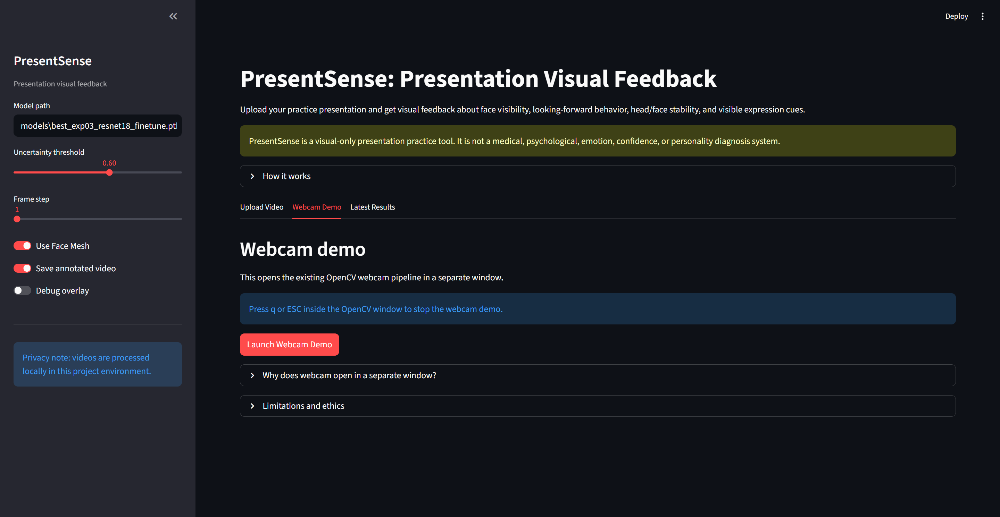

---

### 2. Sidebar Settings

The sidebar allows the user to configure the analysis before running the pipeline.

Available settings include:

- Model path.
- Uncertainty threshold.
- Frame step.
- Face Mesh toggle.
- Annotated video export.
- Debug overlay.

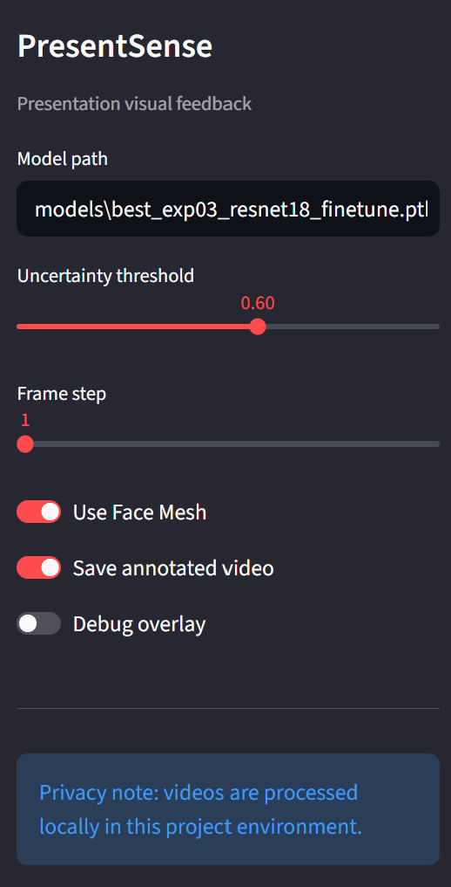

---

### 3. Upload Video Workflow

The user can upload a local practice presentation video and analyze it with the existing `analyze_video.py` pipeline.

Supported formats include:

```text
MP4, MOV, AVI, WEBM
```

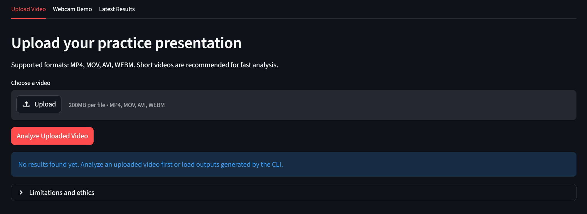

---

### 4. Webcam Demo

The webcam tab launches the existing OpenCV webcam pipeline from the Streamlit app.

The webcam opens in a separate local OpenCV window. To stop the recording and finish the analysis, press:

```text
q
```

or:

```text
ESC
```

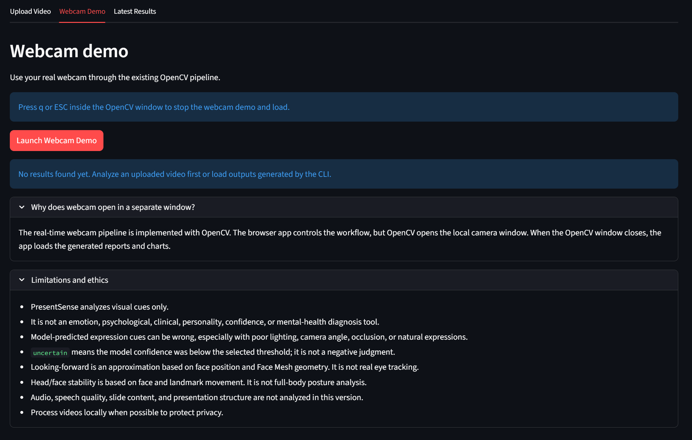

---

### 5. Results Dashboard and Feedback

After analysis, the app displays a clear dashboard with visual communication metrics and friendly feedback.

The dashboard includes:

- Overall score.
- Looking-forward approximation.
- Head/face stability.
- Expression variation.
- Expression variety.
- Face visibility.
- Face Mesh detection rate.
- Average model confidence.

The feedback section separates recommendations into:

- What went well.
- What to improve.

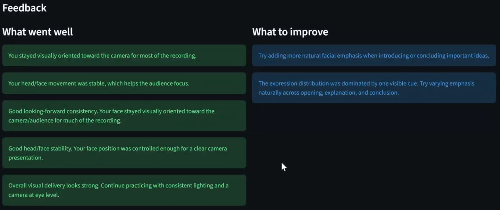

---

### 6. Detailed Charts

The app displays the visual analysis charts generated by the Phase 3 pipeline.

These charts help review how the presentation changed over time.

#### Expression Distribution

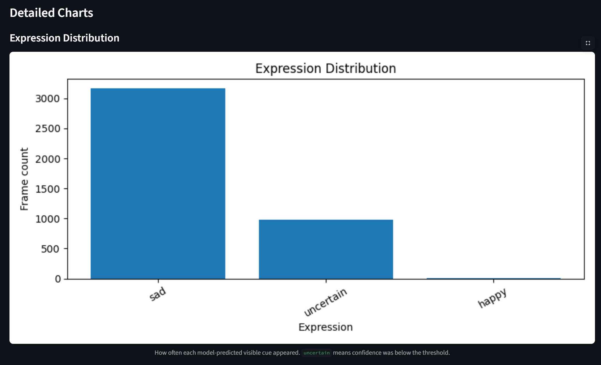

#### Expression Timeline

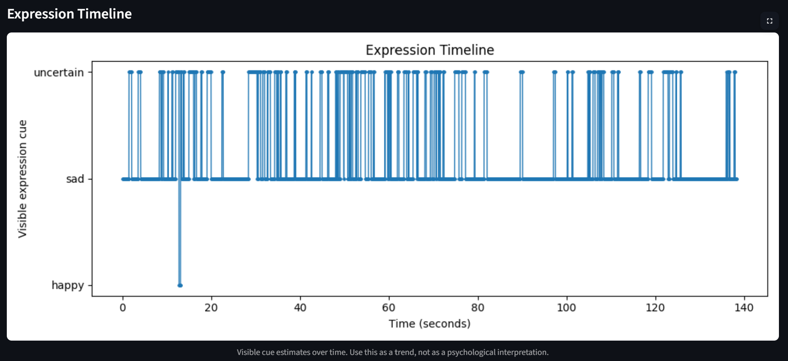

#### Looking-Forward Approximation

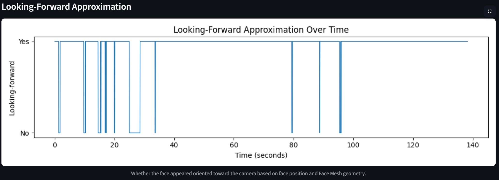

#### Head/Face Movement

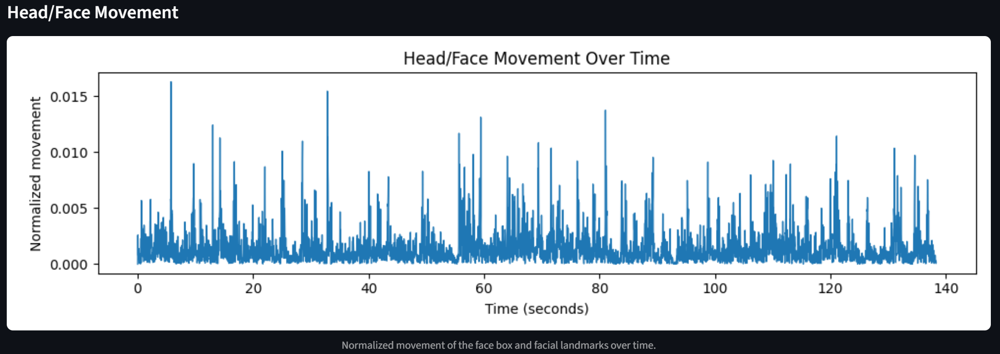

#### Mouth Openness

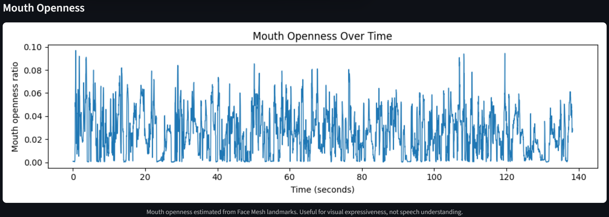

---

### 7. Generated Feedback Report

The app also renders the generated Markdown report inside Streamlit.

The report includes:

- Video information.
- Visible expression summary.
- Geometric Face Mesh cues.
- Visual communication scores.
- Timeline highlights.
- Generated chart paths.
- Recommendations.
- Limitations.

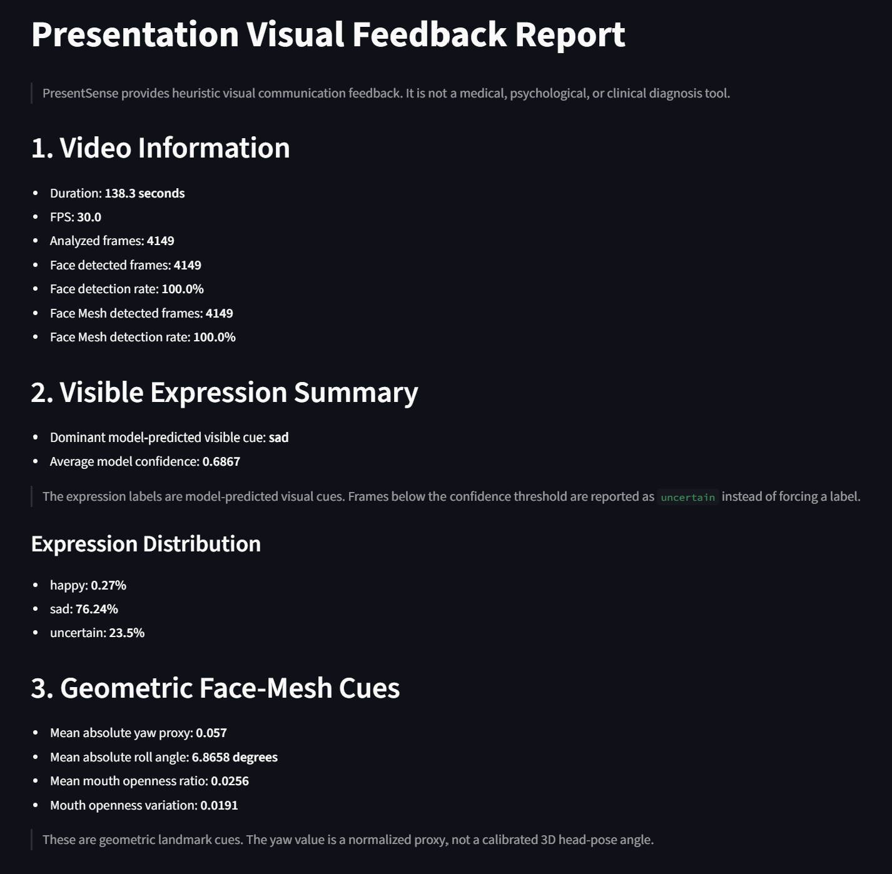

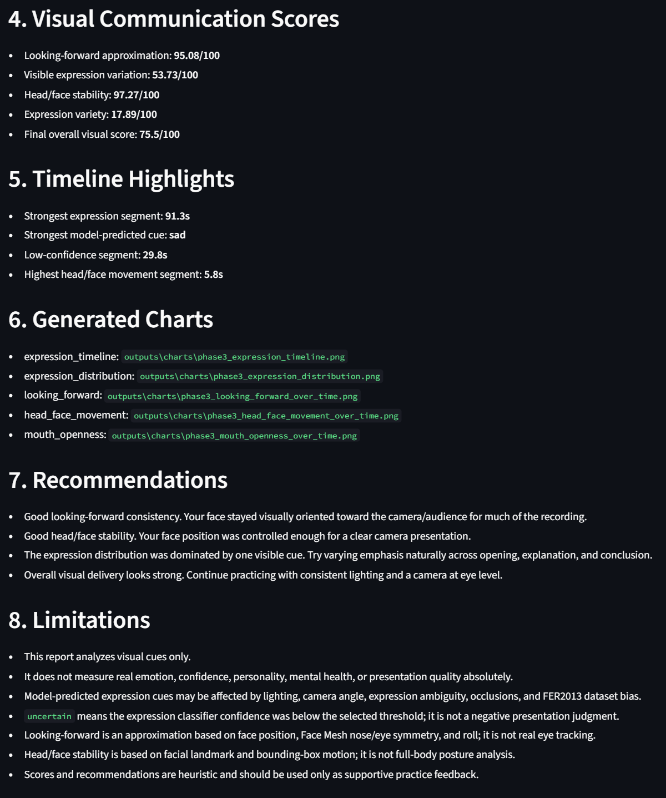

---

### 8. Download and Reset Workflow

The app allows the user to download all generated analysis files as a ZIP file.

The downloadable analysis can include:

```text
presentation_report.md
summary_report.json
frame_metrics.csv
charts/*.png
annotated_video.mp4
```

The reset button clears the current temporary app-generated files and prepares the app for another video.

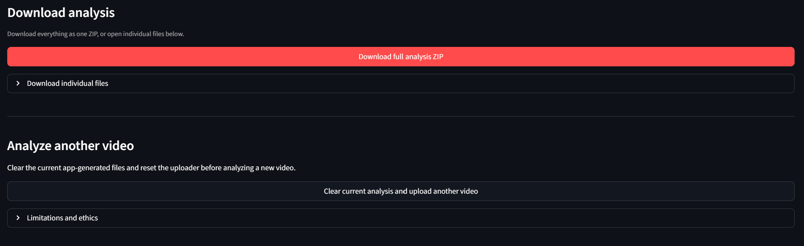

> Temporary app-generated files are saved under `outputs/app/` and should not be committed to GitHub. Only curated screenshots and documentation assets are included in the repository.

---

## Previous Phase Demos

The final project version is demonstrated in the **Phase 4 Streamlit App** section above.

Previous intermediate demos are documented separately to keep this README focused on the final product:

[View Phase 1, Phase 2, and Phase 3 demo history](docs/demo_history.md)

---

## How to Test the Project

### 1. Clone the Repository

```powershell
git clone <repository-url>
cd presentsense
```

### 2. Create and Activate the Environment

Recommended location on Windows:

```powershell
C:\cv\presentsense
```

Create and activate the environment:

```powershell
python -m venv .venv
.\.venv\Scripts\Activate.ps1
python -m pip install --upgrade pip
pip install -r requirements.txt
```

### 3. Add the Model Checkpoint

The trained model checkpoint is ignored by Git because it can be large.

Place the best Phase 2 model here:

```text
models/best_exp03_resnet18_finetune.pth
```

This is the default model used by the app.

### 4. Prepare a Test Video

Record a short presentation practice video of 20 to 30 seconds and save it here:

```text
data/samples/phase4_practice_presentation.mp4
```

Recommended test behavior:

```text
0–8s: look at the camera and speak normally.
8–15s: look slightly to the side as if checking notes.
15–22s: return to the camera and smile slightly.
22–30s: move your head naturally while speaking.
```

This gives the system enough variation to test looking-forward, movement, and expression cues.

### 5. Run the Streamlit App

```powershell
streamlit run app.py
```

The app opens in the browser.

Use the **Upload Video** tab to upload:

```text
data/samples/phase4_practice_presentation.mp4
```

Then click:

```text
Analyze Uploaded Video
```

### 6. Review the Results

After analysis, the app displays:

- Results dashboard.
- What went well.
- What to improve.
- Annotated video, if enabled.
- Detailed charts.
- Markdown report.
- Download buttons.
- Reset button for analyzing another video.

### 7. Download the Analysis

The app provides a full ZIP download containing the generated analysis files when available:

```text
presentation_report.md
summary_report.json
frame_metrics.csv
charts/*.png
annotated_video.mp4
```

### 8. Analyze Another Video

Use the reset button:

```text
Clear current analysis and upload another video
```

This clears temporary app-generated files and resets the upload workflow.

---

## Streamlit App Guide

### Main Page

The main page introduces PresentSense as a visual-only presentation practice tool. It includes an ethics note explaining that the system is not a diagnosis tool and should not be used to infer real emotion, confidence, personality, or mental health.

### Tabs

#### Upload Video

Use this tab to upload and analyze a local presentation video.

Supported formats:

```text
MP4, MOV, AVI, WEBM
```

The uploaded video is saved locally under:

```text
outputs/app/uploads/
```

The generated app outputs are saved under:

```text
outputs/app/
├── uploads/
├── videos/
├── reports/
└── charts/
```

#### Webcam Demo

This tab launches the existing OpenCV webcam pipeline in a separate window.

To stop the webcam demo, press:

```text
q
```

or:

```text
ESC
```

This preserves the original real-time webcam workflow while making it accessible from the app.

#### Latest Results

This tab loads the latest available results from the previous analysis. It is useful when the pipeline was run from the command line or when the user wants to review the most recent output without uploading a new video.

### Sidebar Settings

The sidebar contains the main analysis settings.

#### Model path

Default:

```text
models/best_exp03_resnet18_finetune.pth
```

This is the path to the trained facial expression model used by the pipeline.

#### Uncertainty threshold

Default:

```text
0.60
```

This controls how confident the expression classifier must be before showing a visible expression label. If the confidence is below the threshold, the frame is labeled as:

```text
uncertain
```

This avoids forcing unreliable predictions.

#### Frame step

Default:

```text
1
```

This controls how many frames are skipped during analysis.

- `1` analyzes every frame.
- Higher values make the analysis faster but less detailed.

#### Use Face Mesh

Enables Face Mesh landmark analysis. When enabled, the system estimates additional visual cues such as:

- Looking-forward approximation.
- Head/face stability.
- Mouth openness.
- Landmark-based movement.

#### Save annotated video

When enabled, the pipeline exports an annotated video showing overlays such as:

- Face box.
- Visible expression cue.
- Confidence.
- Looking-forward status.
- Movement status.
- FPS and elapsed time.

#### Debug overlay

When enabled, the overlay can show more technical values, such as yaw proxy, roll angle, and raw mouth openness. This is useful for development but is not necessary for normal users.

#### Privacy note

The app processes videos locally in the project environment. Temporary app-generated files are saved under:

```text
outputs/app/
```

These temporary files should not be committed to GitHub.

---

## Results Dashboard

After analysis, the app displays visual feedback cards.

| Metric | Meaning |
|---|---|
| Overall Score | General heuristic score based on visual communication cues. |
| Looking Forward | Approximation of whether the face is visually oriented toward the camera. |
| Head/Face Stability | How stable the face position appears during the recording. |
| Expression Variation | How much visible expression variation appears in the video. |
| Expression Variety | How balanced the model-predicted visible cues are. |
| Face Visibility | Percentage of frames where a face was detected. |
| Face Mesh Detection | Percentage of frames where Face Mesh landmarks were detected. |
| Average Model Confidence | Average confidence of the expression classifier. |

These scores are heuristic and are intended only for supportive presentation practice feedback.

---

## Feedback Sections

The app separates recommendations into two friendly sections.

### What went well

Examples:

- You stayed visually oriented toward the camera for most of the recording.
- Your head/face movement was stable, which helps the audience focus.
- Your face visibility was strong during the video.
- Positive or warm model-predicted cues appeared during the recording.

### What to improve

Examples:

- Many frames were uncertain. Try improving lighting and camera angle.
- Try adding more natural facial emphasis during key points.
- Reduce excessive head movement if the movement score is high.
- Keep the camera closer to eye level.
- Avoid strongly interpreting expression labels when confidence is low.

---

## Dataset

The expression recognition model was trained using FER2013.

Dataset link:

- FER2013 on Kaggle: https://www.kaggle.com/datasets/msambare/fer2013

The dataset is not included in this repository because of size and licensing considerations. To reproduce training, download it from Kaggle and place it under:

```text
data/fer2013/
```

### Option A: Folder Format

```text
data/fer2013/train/angry/
data/fer2013/train/disgust/
data/fer2013/train/fear/
data/fer2013/train/happy/
data/fer2013/train/neutral/
data/fer2013/train/sad/
data/fer2013/train/surprise/

data/fer2013/test/angry/
data/fer2013/test/disgust/
data/fer2013/test/fear/
data/fer2013/test/happy/
data/fer2013/test/neutral/
data/fer2013/test/sad/
data/fer2013/test/surprise/
```

### Option B: CSV Format

```text
data/fer2013/fer2013.csv
```

Expected CSV columns:

```text
emotion,pixels,Usage
```

---

## Installation

### Windows PowerShell

Recommended location:

```powershell
C:\cv\presentsense
```

Create and activate the environment:

```powershell
python -m venv .venv
.\.venv\Scripts\Activate.ps1
python -m pip install --upgrade pip
pip install -r requirements.txt
```

### macOS / Linux

```bash
python -m venv .venv
source .venv/bin/activate
python -m pip install --upgrade pip
pip install -r requirements.txt
```

### Windows Compatibility Notes

The project pins versions to avoid common MediaPipe/OpenCV/Numpy issues on Windows:

```text
numpy==1.26.4
opencv-contrib-python==4.11.0.86
mediapipe==0.10.21
protobuf==4.25.9
```

---

## Optional GPU Setup

If you have an NVIDIA GPU, install PyTorch with CUDA support.

Example for CUDA 12.6 wheels:

```powershell
pip uninstall torch torchvision torchaudio -y
pip install torch torchvision torchaudio --index-url https://download.pytorch.org/whl/cu126
```

Verify CUDA:

```powershell
python -c "import torch; print(torch.__version__); print(torch.cuda.is_available()); print(torch.cuda.get_device_name(0) if torch.cuda.is_available() else 'No GPU')"
```

---

## Running the Original CLI Commands

The original command-line workflow still works.

### Phase 1 Webcam

```powershell
python analyze_video.py --source webcam
```

### Phase 1 Webcam with Saved Video

```powershell
python analyze_video.py --source webcam --output outputs/videos/phase1_webcam_demo.mp4
```

### Phase 2 Expression Demo

```powershell
python analyze_video.py --source webcam --model models/best_exp03_resnet18_finetune.pth
```

### Phase 2 Saved Demo

```powershell
python analyze_video.py --source webcam --model models/best_exp03_resnet18_finetune.pth --output outputs/videos/phase2_resnet18_emotion_demo.mp4
```

### Phase 3 Visual Metrics

```powershell
python analyze_video.py --source webcam --model models/best_exp03_resnet18_finetune.pth
```

### Phase 3 Saved Demo

```powershell
python analyze_video.py --source webcam --model models/best_exp03_resnet18_finetune.pth --output outputs/videos/phase3_visual_metrics_demo.mp4
```

### Analyze a Local Video

```powershell
python analyze_video.py --source data/samples/phase4_practice_presentation.mp4 --model models/best_exp03_resnet18_finetune.pth --output outputs/videos/phase4_final_demo.mp4
```

### Disable Face Mesh if Needed

```powershell
python analyze_video.py --source webcam --model models/best_exp03_resnet18_finetune.pth --no-face-mesh
```

### Adjust Uncertainty Threshold

```powershell
python analyze_video.py --source webcam --model models/best_exp03_resnet18_finetune.pth --uncertainty-threshold 0.55
python analyze_video.py --source webcam --model models/best_exp03_resnet18_finetune.pth --uncertainty-threshold 0.65
```

Generated root-level files:

```text
outputs/reports/frame_metrics.csv
outputs/reports/summary_report.json
outputs/reports/presentation_report.md
outputs/charts/phase3_expression_distribution.png
outputs/charts/phase3_expression_timeline.png
outputs/charts/phase3_looking_forward_over_time.png
outputs/charts/phase3_head_face_movement_over_time.png
outputs/charts/phase3_mouth_openness_over_time.png
```

Curated example assets are stored in:

```text
outputs/charts/phase3/
outputs/reports/phase3/
outputs/screenshots/phase3/
outputs/screenshots/phase4/
```

---

## Methodology

### Face Detection

MediaPipe detects the presenter's face in each frame. OpenCV draws the bounding box, confidence, FPS, and status overlays.

### Expression Recognition

1. The detected face is cropped with a margin.
2. The crop is resized to `224 x 224`.
3. The crop is normalized using ImageNet statistics.
4. A PyTorch model predicts FER2013 expression classes.
5. Softmax probabilities are smoothed over time.
6. If confidence is below the threshold, the frame is labeled as `uncertain`.

### Face Mesh Geometry

Face Mesh landmarks are used to estimate geometric presentation cues:

- Nose and eye symmetry for looking-forward approximation.
- Face roll angle proxy.
- Nose/landmark movement for head/face stability.
- Mouth openness ratio over time.
- Eye openness variation as part of expression variation.

### Looking-Forward Approximation

This is a heuristic based on face position, Face Mesh nose/eye symmetry, and face roll. It is **not** real gaze tracking and does not guarantee actual eye contact.

### Head/Face Stability

This score uses bounding-box movement and Face Mesh landmark movement. It estimates whether the face remains stable in the camera frame. It is **not** full-body posture analysis.

### Visible Expression Variation

This score combines model-predicted expression probability variation with Face Mesh mouth/eye movement. It estimates variation in visible facial cues, not real emotional state.

### Overall Score

The final score is a heuristic weighted score:

```text
overall_score =
  0.35 * looking_forward_score
+ 0.30 * visible_expression_variation_score
+ 0.25 * head_face_stability_score
+ 0.10 * expression_variety_score
```

---

## Experiments and Results

The experiment results are saved in:

```text
outputs/reports/experiments.csv
```

| Experiment | Model | Epochs | Batch Size | Test Accuracy | Macro F1 |
|---|---|---:|---:|---:|---:|
| exp04 | MobileNetV3 fine-tune | 10 | 32 | 49.53% | 42.74% |
| exp04 | MobileNetV3 fine-tune | 20 | 32 | 51.49% | 45.62% |
| exp03 | ResNet18 fine-tune | 10 | 16 | **64.11%** | **60.87%** |

The best Phase 2 model was **ResNet18 fine-tuned on FER2013**, reaching **64.11% test accuracy** and **60.87% macro F1**.

### ResNet18 Fine-Tune Training Curves

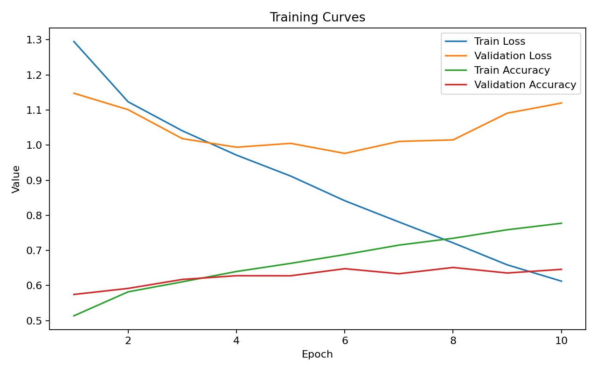

### ResNet18 Fine-Tune Confusion Matrix


### MobileNetV3 Fine-Tune Training Curves

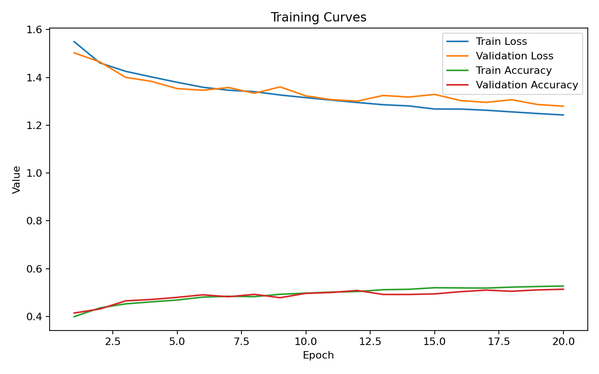

### MobileNetV3 Fine-Tune Confusion Matrix

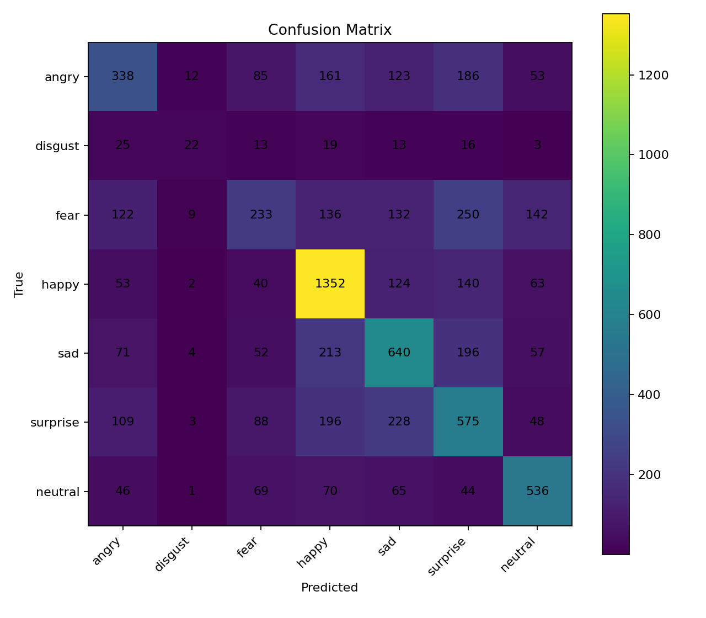

---

## Phase 3 Report Example

Latest Phase 3.5 example:

| Metric | Value |
|---|---:|
| Duration | 19.2 seconds |
| Face detection rate | 100.0% |
| Face Mesh detection rate | 100.0% |
| Dominant model-predicted cue | uncertain |
| Average model confidence | 0.6727 |
| Happy cue percentage | 47.05% |
| Uncertain percentage | 48.44% |
| Looking-forward approximation | 84.9 / 100 |
| Visible expression variation | 55.8 / 100 |
| Head/face stability | 83.76 / 100 |
| Expression variety | 39.45 / 100 |
| Final overall score | 71.34 / 100 |

Interpretation: the system detected the face and Face Mesh reliably. Expression recognition remained uncertain for many frames, so the report treats expression labels as model-predicted visual cues rather than real emotions.

---

## Architecture

PresentSense uses a layered architecture. The main design decision was to keep the working Computer Vision pipeline in `analyze_video.py` and use Streamlit as a product-style interface around it. This keeps the webcam/video processing stable while making the project easier to use.

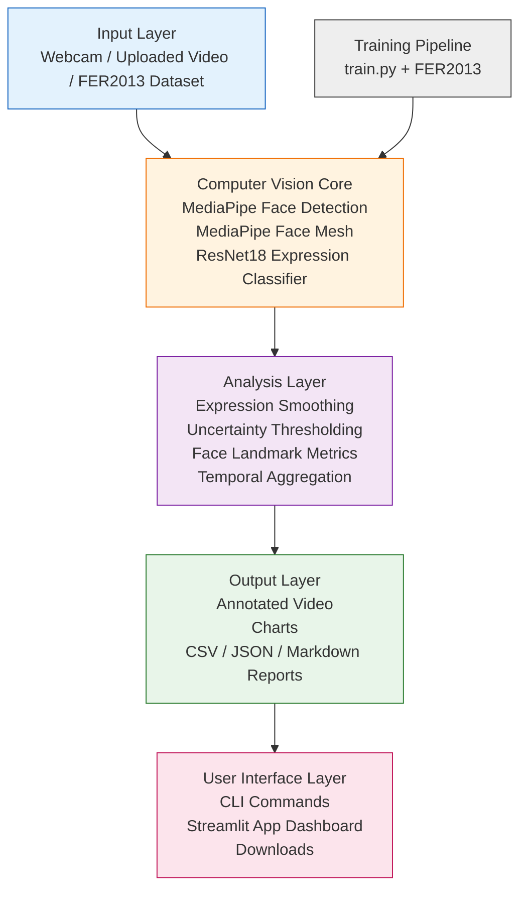

### Main Components

| Layer | Main files | Purpose |
|---|---|---|
| Input | `app.py`, `analyze_video.py`, `dataset.py` | Receives webcam input, uploaded videos, local videos, and FER2013 data. |
| Computer Vision Core | `face_detector.py`, `face_landmarks.py`, `emotion_analyzer.py`, `model.py` | Detects faces, extracts Face Mesh landmarks, and predicts model-based visible expression cues. |
| Analysis | `presentation_metrics.py`, `recommendations.py` | Aggregates frame-level information into presentation scores and feedback. |
| Output | `visualization.py`, `report_generator.py` | Creates overlays, charts, CSV files, JSON summaries, and Markdown reports. |
| UI | `app.py`, `analyze_video.py`, `train.py` | Provides both command-line execution and the final Streamlit app. |

### Design Rationale

- The CLI pipeline remains independent so webcam and video processing stay stable.
- Streamlit calls the existing pipeline instead of duplicating the Computer Vision logic.
- Reports are exported in multiple formats: Markdown for humans, JSON for apps, and CSV for frame-level analysis.
- The model uses `uncertain` predictions when confidence is low to avoid overclaiming facial expression results.

---

## Repository Structure

```text
presentsense/
├── README.md
├── requirements.txt
├── .gitignore
├── LICENSE
├── app.py
├── train.py
├── analyze_video.py
├── config.yaml
├── src/
│   ├── dataset.py
│   ├── model.py
│   ├── train_utils.py
│   ├── face_detector.py
│   ├── face_landmarks.py
│   ├── emotion_analyzer.py
│   ├── presentation_metrics.py
│   ├── recommendations.py
│   ├── visualization.py
│   ├── report_generator.py
│   └── streamlit_utils.py
├── scripts/
├── notebooks/
├── data/
│   └── .gitkeep
├── models/
│   └── .gitkeep
├── outputs/
│   ├── app/
│   │   ├── uploads/
│   │   ├── videos/
│   │   ├── reports/
│   │   └── charts/
│   ├── charts/
│   │   ├── exp03_resnet18_finetune_confusion_matrix.png
│   │   ├── exp03_resnet18_finetune_training_curves.png
│   │   ├── exp04_mobilenet_finetune_confusion_matrix.png
│   │   ├── exp04_mobilenet_finetune_training_curves.png
│   │   └── phase3/
│   ├── reports/
│   │   ├── experiments.csv
│   │   └── phase3/
│   ├── screenshots/
│   │   ├── phase1/
│   │   ├── phase2/
│   │   ├── phase3/
│   │   └── phase4/
│   └── videos/
└── docs/
    ├── methodology.md
    ├── experiments.md
    ├── limitations.md
    └── final_submission_checklist.md
```

---

## GitHub and Large Files

This repository should not include large datasets, large model checkpoints, or temporary app-generated files.

Ignored by default:

```text
data/*
models/*.pth
models/*.pt
.venv/
outputs/app/uploads/*
outputs/app/videos/*
outputs/app/reports/*
outputs/app/charts/*
outputs/videos/*
temporary root-level reports and charts
```

Curated charts, screenshots, and example reports can be committed for README/demo purposes.

Recommended files to commit for Phase 4 documentation:

```text
outputs/screenshots/phase4/phase4_home_sidebar.png
outputs/screenshots/phase4/phase4_upload_video.png
outputs/screenshots/phase4/phase4_results_dashboard.png
outputs/screenshots/phase4/phase4_charts.png
outputs/screenshots/phase4/phase4_download_reset.png
```

Optional final demo video if small enough:

```text
outputs/videos/phase4_final_demo.mp4
```

If the video is too large, keep it outside Git or upload it as a GitHub Release asset and replace the README link.

---

## Limitations and Ethics

- PresentSense analyzes visual presentation cues only.
- It does not measure true confidence, personality, mental health, psychological state, or presentation quality absolutely.
- Model-predicted expression cues may be affected by lighting, camera angle, expression ambiguity, occlusions, and FER2013 dataset bias.
- `uncertain` means the expression classifier confidence was below the selected threshold; it is not a negative presentation judgment.
- Looking-forward is an approximation based on face position, Face Mesh nose/eye symmetry, and roll; it is not real eye tracking.
- Head/face stability is based on facial landmark and bounding-box motion; it is not full-body posture analysis.
- The current version does not analyze speech, audio, slide quality, or content.
- Scores and recommendations are heuristic and should be used as supportive feedback, not absolute judgment.
- Videos should be processed locally when possible to protect privacy.

---

## Future Work

- Improve eye openness and gaze-related visual cues.
- Add eyebrow movement proxy if stable enough.
- Improve facial expression classification with a better dataset or domain adaptation.
- Add audio and speech analysis.
- Add slide synchronization.
- Add multilingual feedback.
- Improve deployment options for the Streamlit app.

---

## License

MIT License.
