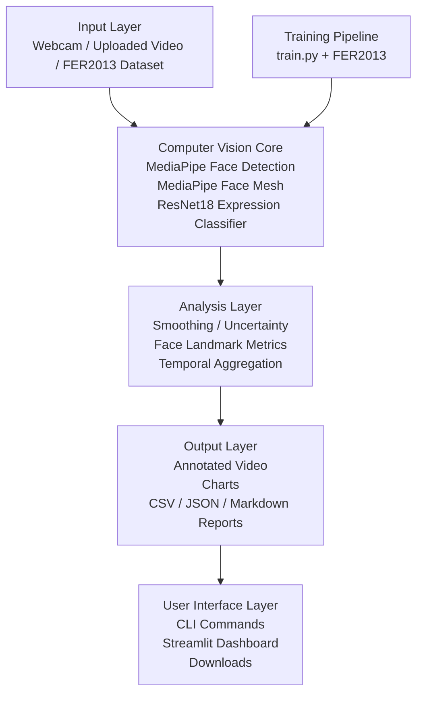

# Architecture

PresentSense uses a layered architecture. The main design decision was to keep the working Computer Vision pipeline in `analyze_video.py` and use Streamlit as a product-style interface around it.

This separation keeps webcam/video processing stable while making the project easier to use.

## Layers

| Layer | Main files | Purpose |
|---|---|---|
| Input | `app.py`, `analyze_video.py`, `dataset.py` | Receives webcam input, uploaded videos, local videos, and FER2013 data. |
| Computer Vision Core | `face_detector.py`, `face_landmarks.py`, `emotion_analyzer.py`, `model.py` | Detects faces, extracts Face Mesh landmarks, and predicts visible expression cues. |
| Analysis | `presentation_metrics.py`, `recommendations.py` | Aggregates frame-level information into presentation scores and feedback. |
| Output | `visualization.py`, `report_generator.py` | Creates overlays, charts, CSV files, JSON summaries, and Markdown reports. |
| UI | `app.py`, `analyze_video.py`, `train.py` | Provides Streamlit, video analysis CLI, and model training CLI. |

## Design Decisions

| Decision | Reason |
|---|---|
| CLI and Streamlit are separated | The OpenCV/MediaPipe webcam pipeline is more stable when executed as its own process. |
| Streamlit calls `analyze_video.py` | Avoids duplicating Computer Vision logic in the UI. |
| Face Mesh is used for visual geometry | It provides facial landmarks without claiming real gaze tracking. |
| `uncertain` label is used | Avoids forcing expression predictions when model confidence is low. |
| Reports are exported in multiple formats | Markdown for humans, JSON for apps, CSV for frame-level analysis. |
