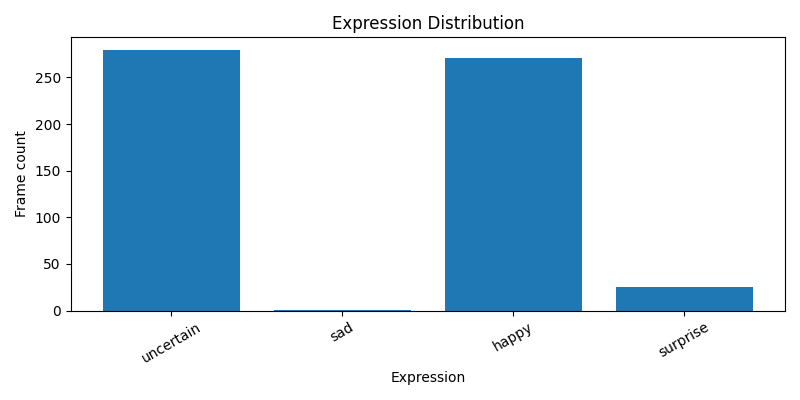
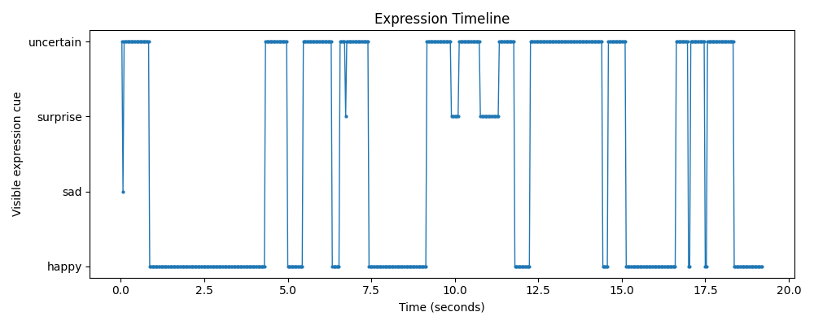
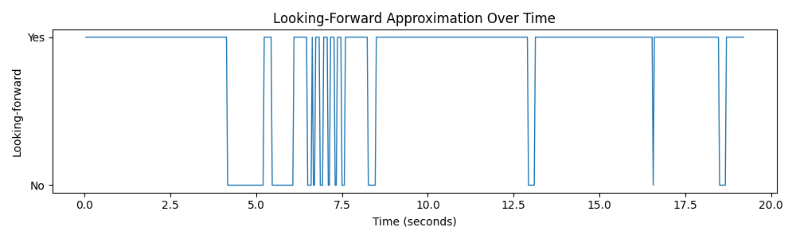
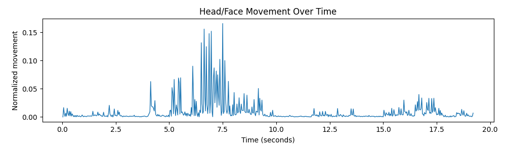
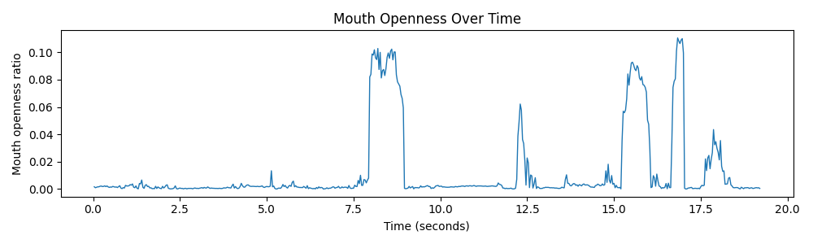

# PresentSense Demo History

This file documents the intermediate demos created during the development of PresentSense.

The final version of the project is presented in the main `README.md`.

---

## Phase 1: Face Detection

Phase 1 validated the real-time OpenCV and MediaPipe face detection pipeline.

Main features:

- Webcam input.
- Local video input.
- MediaPipe face detection.
- Face bounding box overlay.
- FPS and frame number overlay.
- Annotated video export.

### Screenshot

### Demo Video

[Watch Phase 1 Webcam Demo](https://youtu.be/f_9S6_7tmFs)

---

## Phase 2: Face + Expression Recognition

Phase 2 added a FER2013-trained expression recognition model. The model predicts visible facial expression cues from the detected face crop.

Main features:

- FER2013 dataset loader.
- ResNet18 and MobileNet transfer learning experiments.
- Expression prediction from face crops.
- Rolling probability smoothing.
- Uncertainty handling for low-confidence predictions.

### Happy Example

### Sad Example

### Known Limitation Example

The classifier can confuse expressions in real webcam conditions because FER2013 differs from live camera footage in lighting, resolution, pose, and expression intensity.

### Demo Video

[Watch Phase 2 ResNet18 Expression Demo](https://youtu.be/oyC5merH-7Q)

---

## Phase 3: Visual Metrics and Report Generation

Phase 3 combined expression inference with Face Mesh geometry and temporal aggregation.

Main features:

- Face Mesh landmark extraction.
- Looking-forward approximation.
- Head/face stability.
- Mouth openness over time.
- Expression distribution with `uncertain`.
- Markdown, JSON, and CSV report generation.
- Chart generation.

### Example Phase 3.5 Results

| Metric | Value |
|---|---:|
| Duration | 19.2 seconds |
| Analyzed frames | 576 |
| Face detection rate | 100.0% |
| Face Mesh detection rate | 100.0% |
| Average model confidence | 0.6727 |
| Looking-forward approximation | 84.9 / 100 |
| Visible expression variation | 55.8 / 100 |
| Head/face stability | 83.76 / 100 |
| Expression variety | 39.45 / 100 |
| Overall visual score | 71.34 / 100 |

The dominant model-predicted visible cue was `uncertain`, which means many frames were below the confidence threshold. This is intentional: the system avoids forcing expression labels when the classifier is not confident enough.

### Expression Distribution

### Expression Timeline

### Looking-Forward Approximation

### Head/Face Movement

### Mouth Openness

### Demo Video

[Watch Phase 3 Visual Metrics Demo](https://youtu.be/c_Hg-rwFnXA)

---

## Note

These demos show the evolution of the project from basic face detection to the final Streamlit-based presentation feedback app.
